**<h1> Detección de objetos con Yolov5 </h1>**

En este tutorial, nos enfocamos en la detección de autos, utilizando Yolov5x (La arquitectura de Yolov5 más compleja).

**Yolov5**: Es una familia de arquitecturas y modelos de deteccion de objetos entrenados previamente en el conjunto de datos COCO.

***<h2>Procedimiento: </h2>***

**<h3>1. Extracción del Conjunto de imágenes</h3>**

Descargamos la extensión de [Download All Images](https://chrome.google.com/webstore/detail/download-all-images/ifipmflagepipjokmbdecpmjbibjnakm), esto nos permitirá descargar un lote de imágenes en el buscador de google. 

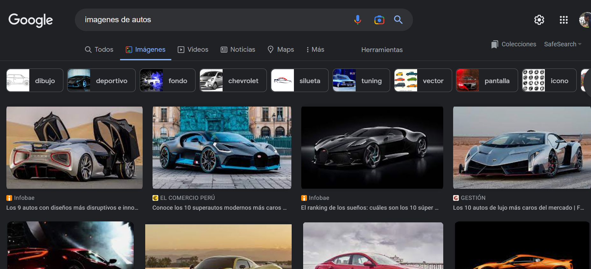
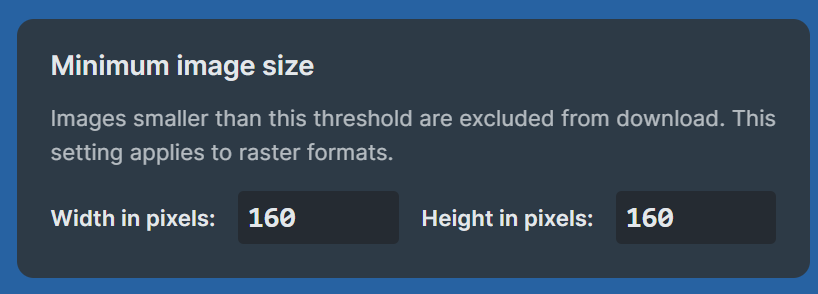

<b>Seleccionamos imágenes específicando el en la extensión que descargaremos imágenes mayores a 160x160 pixeles, conforme hagamos scroll en el buscador, la extensión me descargará todas esas imágenes</b>

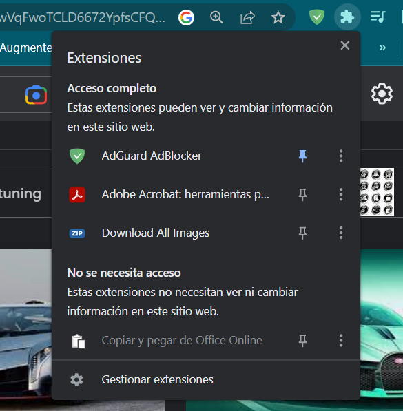

<b>Hacemos click en la extensión, y me descargará un archivo .rar con todas las imágenes</b>

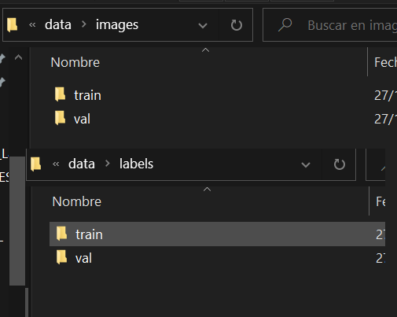

<b>Creamos una carpeta data, que contendrá dos carpetas <b>images</b> y <b>labels</b>, cada carpeta tendra las carpetas train(imágenes etiquetadas para el entrenamiento) y val(imágenes etiquetadas para la validación), en cuestión de la carpeta <b>labels</b> contendrá las etiquetas (cajas delimitadoras de cada imagen) referente a la carpeta images

**<h3>2. División Conjunto de imágenes</h3>**
Descomprimos el archivo de imágenes y procedemos a eliminar imágenes que no sea útiles, fotos de autos incompletas, dibujos de autos, etc.

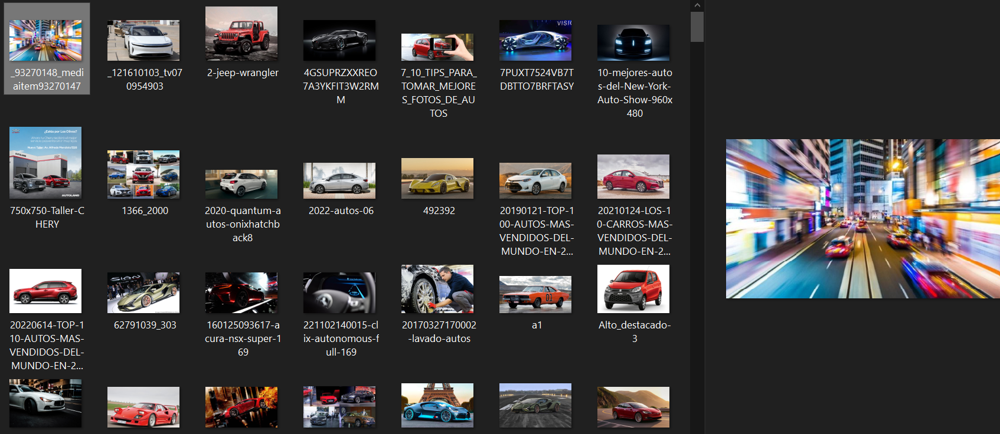

<b>Luego dividimos estas imágenes en 70% (train) y 30% (val)</b> en nuestro caso son 106 train y 46 val, y son guardadas en las carpetas images/train y images/val 

**<h3>3. Etiquetado del Conjunto de imágenes</h3>**
Utilizaremos [MakeSense](https://www.makesense.ai/) para hacer el etiquetado de autos en las imágenes

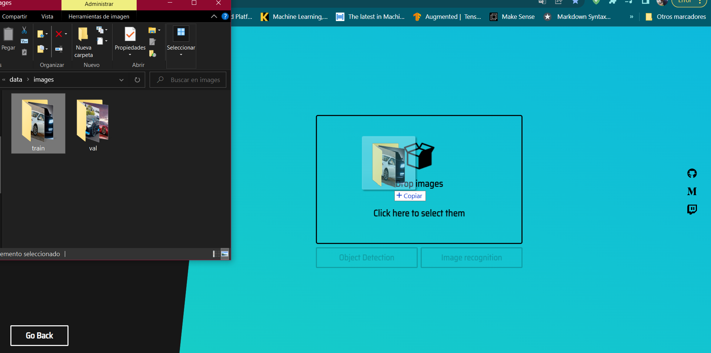

<b>Arrastramos por carpeta, empezamos con train </b> y al finalizar hacemos lo mismo con val

Luego especificamos el nombre de la etiqueta a detectar

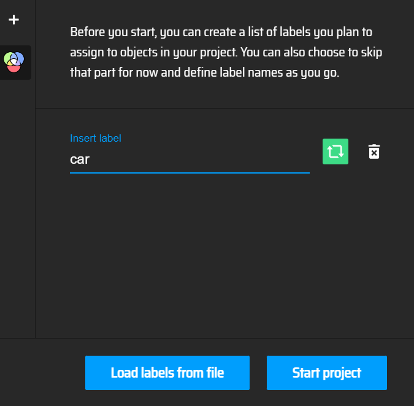

Empezamos a definir el cuadro delimitador del objeto a detectar por cada imagen

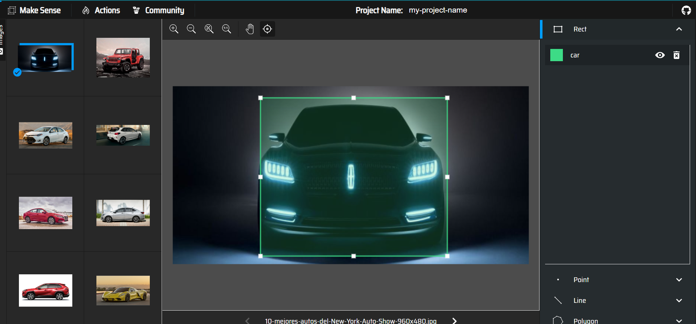

Una vez finalizado, exportamos las etiquetas en el formato adecuado para yolo.

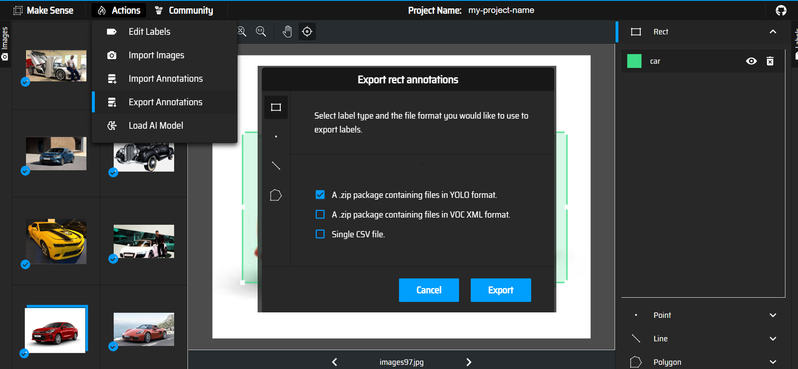

Luego se nos descarga un archivo .rar, el cual descomprimos mostrandonos por cada imagen su respectivos cuadros etiquetados de autos

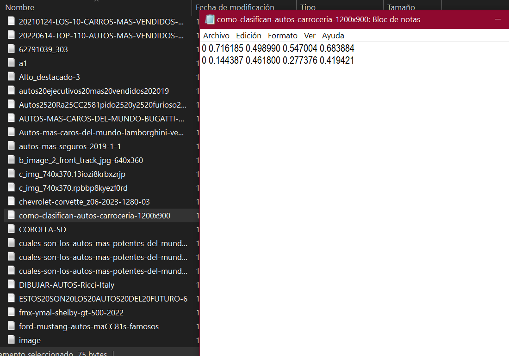

**<h3>4. Entrenamiento de imágenes con Yolov5x</h3>**

Ahora nos dirigimos al [link](https://github.com/ultralytics/yolov5/wiki/Train-Custom-Data) de entrenamiento especificado por yolov5, y abrimos el `YOLOv5 Custom Training Notebook`, Este notebook nos da detalles del entrenamiento que debemos seguir paso a paso.

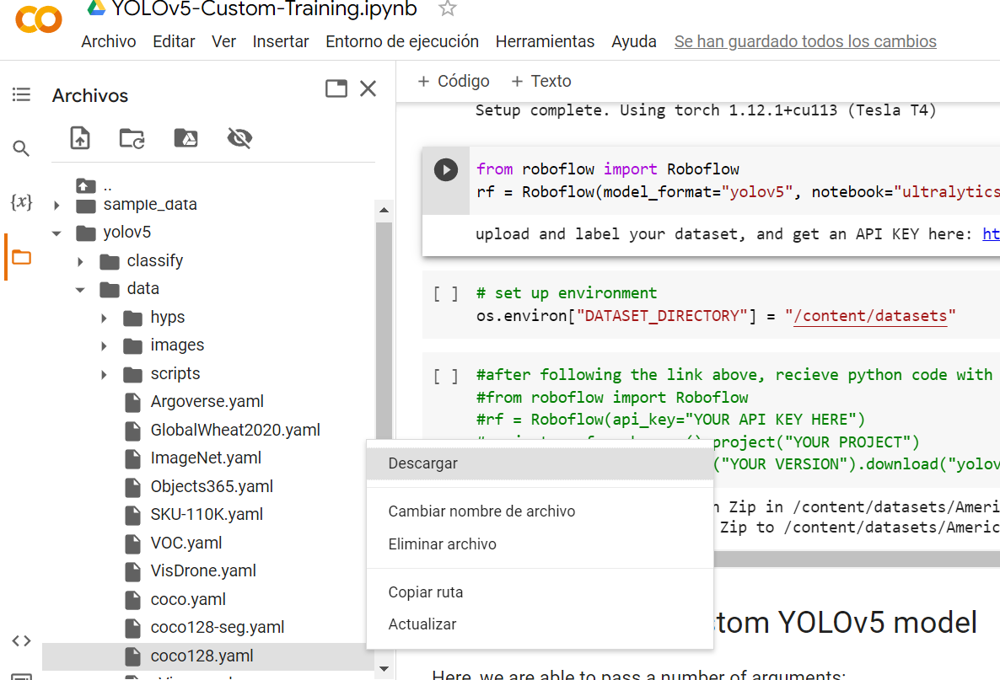

<b>Antes debemos descargar el archivo coco128.yaml, en donde especificaremos la ruta de nuestros datos dentro de colab y el nombre de clase</b> 

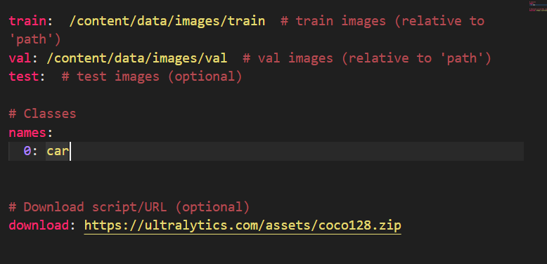

<b>Especificando ruta de datos y clases</b> 

Comprimimos a un archivo rar nuestros datos, y arrastramos en la carpeta de colab, para después descomprimilar dentro y tener nuestros datos en ese entorno

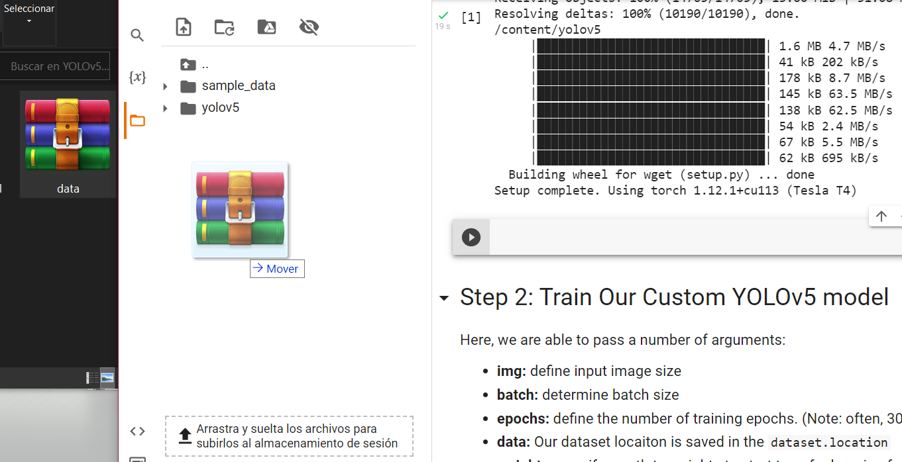

Luego de modificar el coco.yaml, lo renombramos a custom.yaml, y enviamos a la misma ubicación donde la descargamos

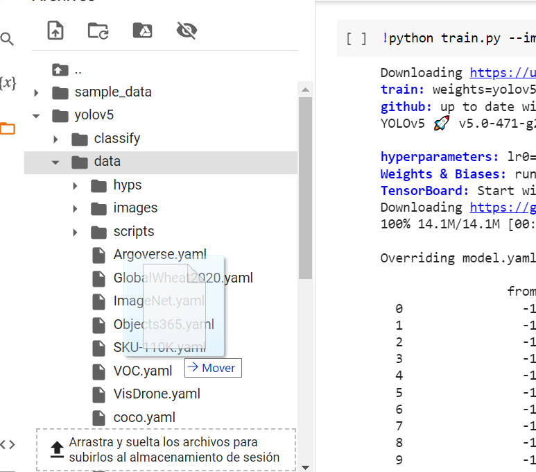

Luego configuramos el entrenamiento, estableciendo el input size, mini batch, epochs, url del curstom.yaml y el tipo de modelo de yolov5

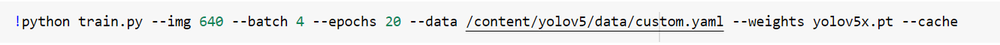

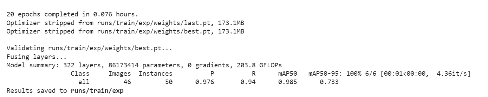

<b>Alcanzandose en 20 epochs una precisión del 97%</b> 

**<h3>5. Descargar pesos de entrenamiento</h3>**
Una vez finalizado, podemos descargar nuestros pesos, para que posteriormente podamos probarlos en nuestras propias inferencias, el modelo descargado se puede descargar en este [enlace](https://drive.google.com/file/d/14SqH1cQtLdpAq0rqtJerlvL9yyUzG3uN/view?usp=share_link).

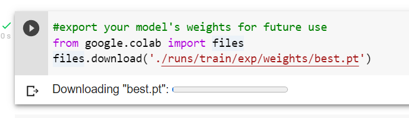

<b>Archivo del tipo pytorch</b> 

**<h3>6. Detecciones personalizadas</h3>**
Según la documentación de yolov5, para poder instalarlo en nuestro entorno debemos instalar los requerimientos que se especifican [aquí](https://docs.ultralytics.com/tutorials/pytorch-hub/)

<b>Instalaciones necesarias</b> 

**<h3>7. Cargando modelo personalizado</h3>**
Ejecutamos el código del archivo detect.py, y se nos abrirá la camará que tomara frames para inferir si contiene autos a detectar

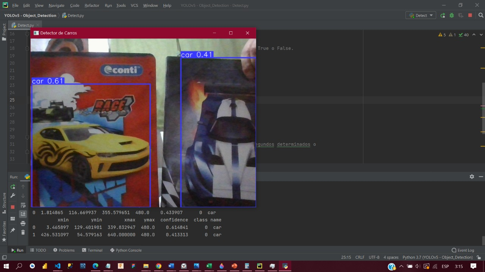

<b>Deteccion de dos imagenes de autos</b> 

